## 🍃初始化项目

按照官网描述的 打开一个终端，并使用以下命令创建一个新的启动项目:

```text
pnpm dlx nuxi init <project-name>
```

你没看错，就算开了科学上网也还是会报错的。所以这里我们[手动访问下载](https://codeload.github.com/nuxt/starter/tar.gz/refs/heads/v3 "https://codeload.github.com/nuxt/starter/tar.gz/refs/heads/v3") ，并将解压后文件夹中的**starter-3**目录中的文件拷贝到自己的项目目录。

进入项目终端，安装项目依赖（node版本至少v16）

```text
pnpm install
```

运行项目

```text
pnpm dev
```

打开本地链接 http://localhost:3000/ 就可以开始访问了。

## 🍃目录结构

理论上一个完整的项目除了常用目录以外，还需要建立 `husky`、`commitlint`、`prettier`、`stylelint`、`tsconfig`等以便更好地规范项目。正常情况下，我们希望项目配置文件比如以上说项目规范配置文件或者是`build`工程化构建相关配置文件、环境变量等放在根目录下，而项目内容（如页面、组件等）统一放在`src`文件夹内管理。所以项目结构最终大致如下：

```text
Nuxt3
├── .husky                        # Git hooks 工具配置
├── .vscode                       # vscode配置
├── doc                           # 项目文档
├── build                         # 工程化构建相关配置
├── src
│   ├── api                       # 接口请求服务管理
│   │  └── modules                # 接口模块
│   ├── assets                    # 工程化处理的静态资源
│   ├── components                # 项目组件
│   ├── composables               # 响应式共享状态
│   ├── enums                     # 枚举管理
│   ├── layouts                   # 布局组件
│   ├── middleware                # 路由中间件
│   ├── pages                     # 页面视图
│   ├── plugins                   # 项目公共插件
│   ├── public                    # 不需要工程化处理的静态资源
│   ├── store                     # 状态管理
│   ├── utils                     # 静态工具函数
│   └── app.vue                   # 入口页面
├── .commitlintrc.json            # git提交规范检查配置
├── .editorconfig                 # 编辑器配置
├── .env                          # 环境变量(默认/开发环境)
├─  .env.local                    # 本地环境变量
├── .env.pre                      # 预发布环境变量
├── .env.prod                     # 生产环境变量
├── .env.test                     # 测试环境变量
├── .eslintignore                 # eslint忽略文件检查的配置
├── .eslintrc.js                  # eslint代码规范检查配置
├── .gitignore                    # git仓库提交忽略配置
├── .lintstagedrc.js              # git提交代码规范检查配置
├── .ls-lint.yml                  # 文件命名检查配置
├── .prettierignore               # prettier忽略格式化的配置
├── .prettierrc.js                # prettier格式化配置
├── .stylelintignore              # 样式规范忽略检查的配置
├── .stylelintrc.js               # 样式规范检查配置
├── nuxt.config.ts                # Vite 构建配置入口
├── package.json                  # 项目包管理文件
├── pnpm-lock.yaml                # pnpm包版本管理锁定
├── postcss.config.js             # postcss配置
├── README.md                     # 项目说明
├── tailwind.config.js            # tailwind配置
└── tsconfig.json                 # TS编译的配置
```

而 Nuxt 初始化，`app.vue`、`pages`文件等都建立在根目录下，所以我们先在根目录下建立 `src` 文件夹，并且把 `app.vue` 文件移入到 `src` 目录下，修改 `nuxt.config.ts`文件配置：

```ts
// https://nuxt.com/docs/api/configuration/nuxt-config
export default defineNuxtConfig({
  srcDir: 'src',
  compatibilityDate: '2024-11-01',
  devtools: { enabled: true }
})
```

接下来我们的pages、components等常用目录就建立在 `src` 目录下。

### .nuxt

Nuxt 使用.nuxt/目录在开发中生成您的Vue应用程序。

你不应该碰里面的任何文件，因为整个目录将在运行 nuxt dev 时重新创建。

* * *

### assets

assets/ 目录用于添加构建工具(webpack或Vite)将处理的所有网站资产。

该目录通常包含以下类型的文件:

+   Stylesheets (CSS, SASS, etc.)
+   Fonts
+   Images
+   Icons

如果你想从服务器上提供资产，可以将文件放入 public/ 目录。

* * *

### components 组件

#### 组件名策略

默认情况下，Nuxt自动导入components目录中的任何组件，组件名将基于它的路径、目录和文件名。

```text
| components/
--| Base
----| Footer.vue
```

如上，该组件名为：BaseFooter

如果只想根据组件的名称而不是路径自动导入组件，那么需要在 nuxt.config.ts 文件中将 `pathPrefix` 选项设置为false，此时与Nuxt2的命名策略相同：

```ts
export default defineNuxtConfig({
  components: [
    {
      path: '~/components/',
      pathPrefix: false,
    },
  ],
});
```

```text
| components/
 --| Base
----| Footer.vue
```

如上，该组件名为：Footer

#### 绕过自动导入

+   可以在 nuxt.config.ts 文件中在 components 下配置 path；只有 path 配置路径下的组件才会被自动导入

```text
| components/
--| business/
----| Count.vue
--| public/
----| MyImg.vue
```

```ts
export default defineNuxtConfig({
   components: [
      {
         path: '~/components/public', // 默认为 '~/components'
      },
    ],
});
```

如上只有 public 目录下的组件将被注册，且自动注册的组件名为 MyImg (非 PublicMyImg)；business 目录下的组件将被忽略。

+   可以配置 components 为 false，此时 components 下任何组件都不会被自动导入。

```ts
export default defineNuxtConfig({
   components: false,
});
```

+   也可以显式地从 #components 导入组件。

```html
<template>
   <div>
      <LazyMyImg />
   </div>
</template>
<script setup>
   import { LazyMyImg } from '#components'
</script>
```

#### 惰性加载组件

要动态导入一个组件(也称为惰性加载组件)，则在组件名称前添加 `Lazy` 前缀。通过使用 `Lazy` 前缀，你可以延迟加载组件代码，直到合适的时刻

```html
<template>
   <div>
      <MyImg />
      <LazyMyImg />
   </div>
</template>
```

* * *

### composables

composables 目录下的内容也将自动将  Vue 组合导入到应用中，Nuxt 只扫描 composables/ 目录的顶层文件。Composables 的主要作用是将常用逻辑和逻辑相关的代码抽象出来，以提高代码可复用性和可维护性，如：跨组件创建响应性的、对ssr友好的共享状态—— `useState`。

```ts
/**
* composables/counter.ts 内容
**/
export const userCounter = () => {
   return useState('counter', () => 0);
};
```

```html
/**
* 业务组件
**/
<script setup>
  import Count from "~/components/business/Count.vue";
  const counter = userCounter();
</script>
<template>
  <div>
    业务组件内容: {{ counter }}
    <a-button type="primary" @click="counter--"> － </a-button>
    <a-button type="primary" @click="counter++"> ＋ </a-button>
  </div>
</template>
```

```html
/**
* business/Count 组件内容
**/
<template>
  <div>Count组件内容：{{ counter }}</div>
</template>
<script setup lang="ts">
  const counter = userCounter();
</script>
```


* * *

### layouts

Nuxt提供了一个可定制的布局框架，可以在整个应用程序中使用，非常适合将常见的UI或代码模式提取到可重用的布局组件中。布局放在layouts/目录中，使用时将通过异步导入自动加载。

#### 默认布局

在layouts目录下添加default.vue 布局文件。

不像其他组件，布局组件必须有一个根元素，以允许 Nuxt 在布局变化之间应用过渡-这个根元素不能是<slot />。如果你的应用只有一个布局，建议使用app.vue。

在布局文件中，布局的内容将加载在<slot />中，~/layouts/default.vue:

```html
<template>
   <div>
      <slot />
   </div>
</template>
```

如果你使用app.vue你还需要添加 :

```html
<template>
   <NuxtLayout>
      // 在app.vue中没有NuxtLayout组件，内容将会不显示
   </NuxtLayout>
</template>
```

#### 配置布局

```text
-| layouts/
---| default.vue
---| custom.vue
```

可以在 NuxtLayout 中添加 `name` 属性来覆盖默认布局:

```html
<template>
   <NuxtLayout :name="layout">
      <NuxtPage />
   </NuxtLayout>
</template>
<script setup>
   // 您可以根据API调用或登录状态来选择此选项
   const layout = "custom";
</script>
```

也可以通过 `definePageMeta` 设置

```html
<template>
  <NuxtLayout>
    巴拉巴拉小魔仙
  </NuxtLayout>
</template>
<script setup>
  definePageMeta({
    layout: "custom",
  });
</script>
```

> 如果业务组件不使用 `<NuxtLayout>` 组件包裹，配置布局是不会生效的

* * *

### middleware 中间件

Nuxt提供了一个可定制的路由中间件框架，可以在整个应用程序中使用，可以认为路由中间件就是导航守卫，因为它接收当前路由和下一个路由作为参数。

路由中间件有三种:

#### 匿名(或内联)路由中间件

直接在使用它们的页面中定义。

```ts
<script setup>
   definePageMeta({
      middleware: [
          defineNuxtRouteMiddleware((to, from) => {
             console.log('匿名路由中间件', to, from)
          }),
      ],
   });
</script>
```

#### 命名路由中间件

放置在middleware/ 目录中，在页面上使用时会通过异步导入自动加载。(注意:路由中间件名称被规范化为串串形式，因此someMiddleware 变成 some-middleware。)

```text
-| middleware/
---| auth.ts
```

```ts
<script setup>
   definePageMeta({
      middleware: ['auth'],
   });
</script>
```

#### 全局路由中间件

放置在 middleware/目录中(带有`.global`后缀)，并将在每次路由更改时自动运行。

```text
-| middleware/
---| auth.global.ts
```

> 带 `.global` 后缀的全局路由中间件，执行顺序优先于app.vue

Nuxt提供了两个全局可用的辅助函数，它们可以直接从中间件返回:

+   `navigateTo` 在插件或中间件中重定向到给定的路由。也可以直接调用它来执行页面导航。

+   `abortNavigation` 终止导航，并显示一条可选的错误消息。


不像 vue-router 中的导航守卫，第三个 next() 参数不会被传递，重定向或路由取消是通过从中间件返回值来处理的。可能的返回值有:

+   `nothing` 不会阻塞导航，并且会移动到下一个中间件功能(如果有的话)，或者完成路由导航

+   `return navigateTo('/')` - 重定向到给定的路径，并将重定向代码设置为302 Found

+   `return navigateTo('/', { redirectCode: 301 })` - 重定向到给定的路径，并将重定向代码设置为301 Moved permanent


```ts
navigateTo(to: RouteLocationRaw | undefined | null,options?: NavigateToOptions) => 
    Promise<void | NavigationFailure> | RouteLocationRaw

interface NavigateToOptions {
  replace?: boolean
  redirectCode?: number
  external?: boolean
}
```


> Q：默认情况下，navigateTo 将给定的路由推送到客户端 Vue Router 的实例中。
>
> 在 middleware 调用 pinia-acitons 里面的函数，函数内执行 navigateTo(url) 会失效?
>
> A：在插件、中间件、vue 文件的 setup 里面是可以调用 navigateTo 的。但是在调用 navigateTo 时，确保 `await` 或者 `return` 作为 navigateTo 的结果，否则终端就会有报错提示(如下图)，页面跳转失败。建议默认使用 await 作为 navigateTo 的结果。


#### middleware 实现单点登录

```text
-| middleware/
---| auth.global.ts
-| enums/
---| auth.ts
```

```ts
/**
* enums/auth.ts
**/
export enum Wh	itePageEnum {
   BASE_HOME = 'index',
   SERVER_ERROR_PAGE = 'error',
   FETCH_TEST_PAGE = 'fetch',
}
```

```ts
/**
* middleware/auth.global.ts
**/
import { WhitePageEnum } from "~/enums/auth";
import { useUserStore } from "~/store/modules/user";
// 白名单
const whitePathList: WhitePageEnum[] = [
  WhitePageEnum.BASE_HOME,
  WhitePageEnum.SERVER_ERROR_PAGE,
  WhitePageEnum.FETCH_TEST_PAGE,
];
export default defineNuxtRouteMiddleware(async (to) => {
  const userStore = useUserStore();
  // 从 store 获取用户信息
  let { userId } = userStore.getUserInfo;
  if (!userId) {
    const res = await userStore.fetchUserInfo();
    userId = res?.userId;
  }
  if (!whitePathList.includes(to.name as WhitePageEnum)) {
    if (!userId) {
      const nuxtApp = useNuxtApp();
      const { _route, $login } = nuxtApp;
      await $login(_route?.fullPath);
    }
  }
});
```

useUserStore 内容可以参考本文档状态管理-引入pinia部分

### pages 页面

页面目录。Nuxt 提供了一个基于文件的路由，使用 Vue Router 在底层创建路由。pages/index.vue 文件将被映射到应用程序 / 路由。

如果你正在使用app.vue，确保在 app.vue 使用 `<NuxtPage/>` 组件来显示当前页面。

#### 动态路由

建立页面文件时，如果命名时将任何内容放在方括号内，它将被转换为路由参数。在文件名或目录中混合和匹配多个参数。

```text
-| pages/
---| index.vue
---| users-[group]/
-----| [id].vue
```

会生成路由：

```ts
{
   "routes": [
     {
        "name": "users-group-id",
        "path": "/users-:group()/:id()",
        "component": "~/pages/users-[group]/[id].vue"
     },
   ]
}
```

根据上面的例子，你可以通过 $route 对象中的 params 访问组件中的 group & idx

```html
<template>
   <ul class="text-base text-gray-600">
     <li>
        获取到的 group 是 <span class="text-green-500 text-xl">{{ group }}</span>
     </li>
     <li>
        获取到的 id 是 <span class="text-green-500 text-xl">{{ id }}</span>
     </li>
   </ul>
</template>
```

导航到 /users-xxh/xry 将呈现： 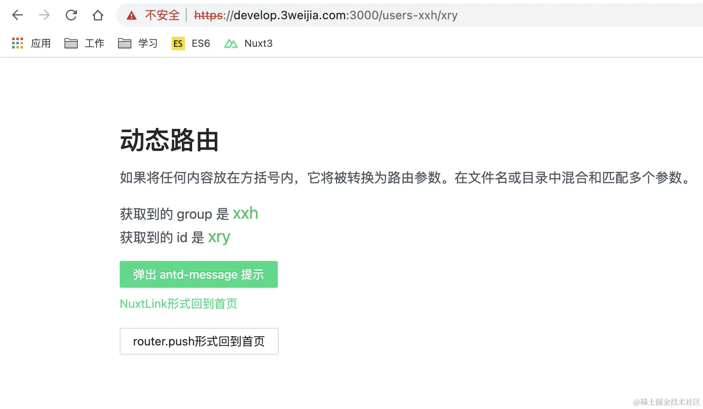

#### 与 Nuxt2 区别

##### 文件命名规则

Nuxt3 在 page 目录下，新建文件命名时，将任何内容放在方括号内，它将被转换为动态路由参数。还可以在文件名或目录中混合和匹配多个参数，甚至是非动态文本。如下路由，group 与 id 都是必选项。

```diff
-| pages/
---| users-[group]/
-----| [id].vue
```

Nuxt2则需要创建对应的以下划线作为前缀的 Vue 文件 或 目录。如下路由，与 Nuxt3 不一样的是 id 是可选项。

```diff
-| pages/
---| users/
-----| _id.vue
```

##### Route Validation

Nuxt3通过 `definePageMeta` 中的 `validate` 属性在你想要验证的每个页面中提供路由验证。

validate 属性接受 route 作为参数。它返回一个布尔值，以确定这是否是要用此页呈现的有效路由。如果返回 false ，并且无法找到另一个匹配项，这将导致`404`错误。也可以直接返回一个带有 `statusCode/statusMessage`的对象，以立即响应一个错误(其他匹配不会被检查)。当 group 或者 id 为空时，页面会直接显示404错误。

```ts
<script setup>
  definePageMeta({
     validate: async (route) => {
        return /^\d+$/.test(route.params.id); // 判断id只能是数字
     },
  });
</script>
```

nuxt2 则通过 Options API 中的 `validate` 来判断 params 的准确性

```html
<template>
  <div> </div>
</template>
<script>
export default {
   validate({ params }) {
       const { group, id } = params;
       if (!group || !id) return false;
       return true;
   }
};
</script>
```

#### 嵌套路由

可以使用   来显示嵌套路由。示例：

```text
    -| pages/
    ---| parent/
    ------| child.vue
    ---| parent.vue
```

这个文件树将生成这些路由:

```js
    [
      {
        path: '/parent',
        component: '~/pages/parent.vue',
        name: 'parent',
        children: [
          {
            path: 'child',
            component: '~/pages/parent/child.vue',
            name: 'parent-child'
          }
        ]
      }
    ]
```

要显示 child.vue 组件，你必须在 pages/parent.vue 中插入 `<NuxtPage>` 组件:

```html
    <!-- parent.vue -->
    <template>
      <div>
        <h1>I am the parent view</h1>
        <NuxtPage/>
      </div>
    </template>

    <!-- child.vue -->
    <template>
      <div>
        <p class="text-base text-gray-600">
          I am the child view
        </p>
      </div>
    </template>
```


#### 页面导航

与 vue3.js 一样，在 setup 可以使用 useRouter、useRoute 来获取路由信息。

```ts
<script setup>
  const route = useRoute();
  const router = useRouter();
  const { id } = route.params;
      
  console.log(router.getRoutes());

  const handlerToHome = () => {
    router.push("/");
  };
</script>
```

通过 router.getRoutes() 我们可以获取到当前 web 项目所有的路由，打印获取到上述动态路由的 name 和 path 如下

```json
    {
      "name": "users-group-id"
      "path": "/users-:group()/:id()"
    }
```

我们可以跟 vue3.js 一样，在 setup 中通过 useRouter() 对象，使用 router.push / router.replace 等对路由进行导航。也可以使用 `<NuxtLink>` 组件，你可以将 `<NuxtLink>`  看成 vue 中的 `<routerLink>`

#### metaData

如果想在应用程序中为每个路由定义元数据，可以使用definePageMeta宏来实现这一点，它将在

```html
<script setup>
definePageMeta({
  title: 'My home page'
})
  
const route = useRoute()
console.log(route.meta.title) // My home page
</script>
```

#### 自定义路由

##### 配置~/app/router.options.ts

在/src目录新增app文件夹，文件夹下建立router.options.ts文件（如果没有使用本文中的/src目录的配置，要在根目录下新增app文件夹）。该文件返回定制路由的函数来覆盖路由，如果返回 null 或 undefined， Nuxt将退回到默认路由。

```text
-| pages/
---| index.vue
```

```ts
import type { RouterConfig } from "@nuxt/schema";
export default <RouterConfig>{
   routes: (_routes) => [
      {
         name: "home",
         path: "/home",
         component: () => import("~/pages/index.vue"),
      },
   ],
};
```

效果如下图：访问 `/home` 可生效 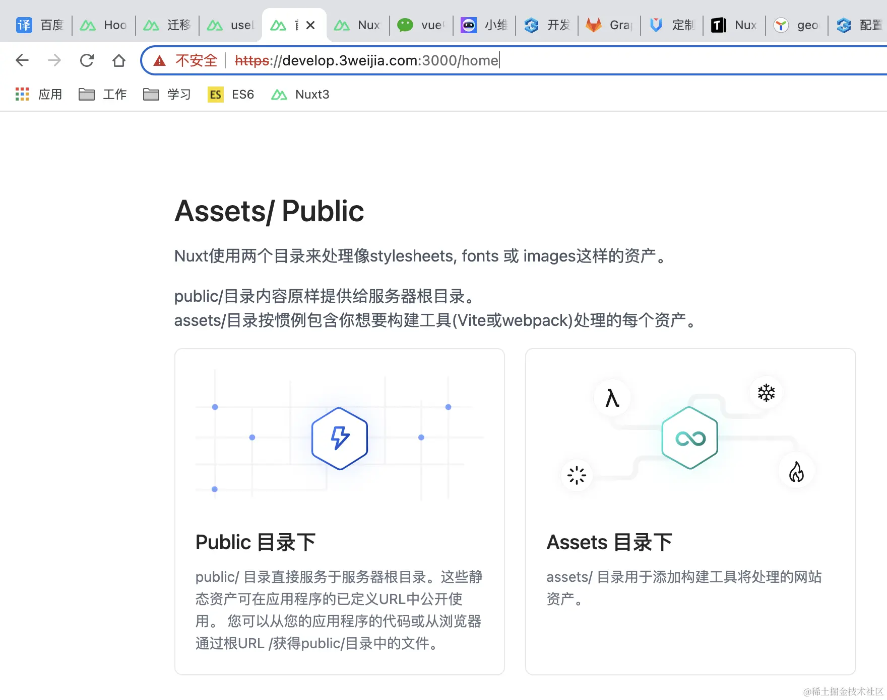

访问其他未定义页面路由，比如原本的 `/`，提示 `404`；原因是自定义路由完全替换了自动生成的路由。如果我们只是希望在自动导入的路由下，添加自定义路由，应该使用 `pages:extend` 钩子配置 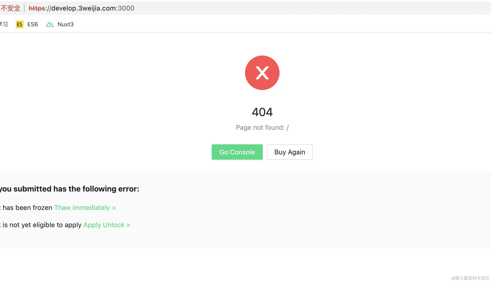

##### 配置nuxt.config.ts

使用 pages:extend 钩子配置扩展路由

```ts
import { NuxtConfig } from "nuxt/config";
import { NuxtPage } from 'nuxt/schema';
    
export default defineNuxtConfig({
  hooks: {
    'pages:extend'(pages: NuxtPage[]) {
      pages.push({
        name: 'error',
        path: '/error',
        file: '~/error.vue',
        // 可以传递 props 到业务组件内
        props: {
          error: {
            statusCode: '500',
            statusMessage: '服务器开小差啦，请稍后重试',
          },
        },
      });
    },
  },
} as NuxtConfig);
```

```ts
// 感觉是nuxt3 ts的一个忽略，它定义的 NuxtPage 如下，但其实可以传入 props 属性
type NuxtPage = {
    name?: string;
    path: string;
    file?: string;
    meta?: Record<string, any>;
    alias?: string[] | string;
    redirect?: string;
    children?: NuxtPage[];
};
```

因为我们的 error.vue 是接受一个 `error` 的 `props` 参数的，具体可以查看本文的「错误处理」，这里不再赘述。

这样我们就访问 /error 路径，并且业务组件能获取到我们传递的 `props` 参数，效果如下~ 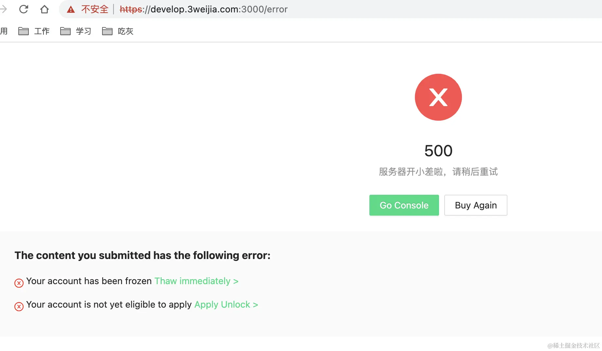

* * *

### plugins 插件

Nuxt自动读取 plugins 目录中的文件，并在创建 Vue 应用程序时加载它们。可以在文件名中使用`.server`或`.client`后缀来只在服务器端或客户端加载插件。

只有在plugins/目录的顶层的文件(或任何子目录中的索引文件)才会被注册为插件。

传递给插件的唯一参数是 nuxtApp。下面是注册 ant-design-vue 的 message 到 plugins 的示例。

```ts
import { message } from 'ant-design-vue';
import 'ant-design-vue/es/message/style/css'; 
//vite只能用 ant-design-vue/es 而非 ant-design-vue/lib

export default defineNuxtPlugin(() => {
  return {
    provide: {
      message,
    },
  };
});
```

在 vue 文件 setup 中使用

```html
<template>
  <div class="post-id">
    <div class="h-10">
      <a-button type="primary" @click="$message.info('测试提示')">
        弹出 antd-message 提示
      </a-button>
    </div>
  </div>
</template>
```

在 middleware 中使用

```ts
export default defineNuxtRouteMiddleware(async (to) => {
  const nuxtApp = useNuxtApp();
  const { $message } = nuxtApp;
  $message.error('服务器异常，请稍后重试');
});
```

* * *

### public

public/目录直接服务于服务器根目录，包含必须保留其名称的公共文件(例如：robots.txt)或可能不会更改(例如:favicon.ico)。

* * *

### serve

* * *

### utils

Nuxt 3 使用 utils/ 目录在整个应用程序中使用自动导入辅助函数和其他实用程序。

* * *

### app.vue

app.vue 是应用程序的主要组件，可以在组件中定义全局的样式和行为，如路由全局守卫和错误处理等。当应用程序启动时，app.vue 会被渲染为根视图组件，并且在应用程序的整个生命周期内始终存在，可以说 app.vue 是 Nuxt.js 3 应用程序的视图层的入口文件。

* * *


### nuxt.config.ts

Nuxt 可以用一个 nuxt.config 文件轻松配置，该文件可以有js, ts or mjs扩展名。defineNuxtConfig 辅助函数是全局可用的，无需导入。nuxt.config.ts文件位于Nuxt项目的根目录下，可以覆盖或扩展应用程序的行为。

```ts
export default defineNuxtConfig({
   // My Nuxt config
})
```

* * *

### app.config.ts

Nuxt 3提供了一个app.config配置文件公开应用程序中的响应性配置，能够在生命周期内的运行时更新它。

```ts
export default defineAppConfig({
   // My App config
})
```


## 🍃状态管理

### useStore

```
在目录结构 composables 中，我们介绍了 useState 可组合的功能，可以跨组件创建响应性的、对ssr友好的共享状态。useState是一个ssr友好的ref替换，它的值将使用唯一的键在所有组件之间共享。

永远不要在 <script setup> 或 setup() 函数之外定义 const state = ref()

这样的状态将被所有访问您的网站的用户共享，并可能导致内存泄漏!

用 const useX = () => useState('x') 代替
```

* * *

### 引入pinia

终端安装 @pinia/nuxt

```sql
yarn add @pinia/nuxt
```

需要在 nuxt.config.ts 上配置

```ts
import { NuxtConfig } from "nuxt/config";

export default defineNuxtConfig({
  modules: ["@pinia/nuxt"],
} as NuxtConfig);
```

创建 store 目录，并在目录下创建状态管理模块，如下是用户登录信息的示例：

```ts
import { defineStore } from "pinia";
import { selectByUserIdBySlient } from "~/api/modules/system/user";
import { FecthUserInfoResp } from "~/api/modules/system/model/UserType";
export const useUserStore = defineStore("user", {
  state: () => ({
    userInfo: {},
  }),
  getters: {
    getUserInfo(): FecthUserInfoResp {
      return this.userInfo || {};
    },
  },
  actions: {
    async fetchUserInfo(): Promise<FecthUserInfoResp> {
      const res = await selectByUserIdBySlient();
      if ((res as FecthUserInfoResp)?.userId) {
        this.userInfo = res;
      } else {
        this.userInfo = {};
      }
      return { ...this.userInfo };
    },
  },
});
```

在项目中，我们可以这样使用

```ts
import { useUserStore } from "~/store/modules/user";

// 获取用户信息
const userStore = useUserStore();
let { userId } = userStore.getUserInfo;
if (!userId) {
  const res = await userStore.fetchUserInfo();
  userId = res?.userId;
}

console.log(userId ? "用户已登录" : "用户未登录")
```

## 🍃错误处理

Nuxt 3是一个全栈框架，这意味着在不同的上下文中，有几种不可避免的用户运行时错误来源:

+   Vue渲染生命周期中的错误(SSR + SPA)
+   API或Nitro服务器生命周期中的错误
+   服务器和客户端启动错误(SSR + SPA)
+   下载JS块时出错

### 渲染一个Error页面

当Nuxt遇到致命错误时，无论是在服务器生命周期中，还是在呈现您的Vue应用程序(SSR和SPA)时，它都会呈现一个JSON响应(如果请求带有Accept: application/json标头)或一个HTML错误页面。我们可以通过在应用程序的源目录中app.vue旁边添加~/error.vue来自定义这个错误页面。这个页面有一个单一的prop—— error，它包含一个错误信息。具体可以参考以下自定义 error.vue 内容：


```html
<template>
  <a-result
    status="error"
    :title="error.statusCode"
    :sub-title="error.message || error.statusMessage || '服务器发生错误，请联系管理员'"
  >
    <template #extra>
      <a-button key="console" type="primary">Go Console</a-button>
      <a-button key="buy">Buy Again</a-button>
    </template>
    <div v-html="error.stack"></div>
  </a-result>
</template>
<script setup>
  import { CloseCircleOutlined } from '@ant-design/icons-vue';
  
  const props = defineProps({
    error: Object,
  });
  
  const { error } = toRefs(props);
</script>
<style lang="less" scoped>
  .desc p {
    margin-bottom: 1em;
  }
</style>

```

### Error 辅助函数

| 方法        | 描述                                                         | 使用方式                                                     |
| ----------- | ------------------------------------------------------------ | ------------------------------------------------------------ |
| createError | 如果你抛出一个用 createError 创建的错误: 在服务器端，它将触发一个全屏错误页面，你可以用 clearError 清除。 在客户端，它会抛出一个非致命的错误让你处理。如果你需要触发一个全屏错误页面，那么你可以通过设置 fatal: true 来实现。 | function createError (err: { cause, data, message, name, stack, statusCode, statusMessage, fatal }): Error |
| showError   | 在客户端的任何地方调用这个函数，或者(在服务器端)直接在中间件、插件或setup()函数中调用，都将触发一个全屏错误页面，可以用clearError清除。 | function showError (err: string                              |
| clearError  | 这个函数将清除当前处理的Nuxt错误。它还有一个可选的重定向路径(例如，如果你想导航到一个“安全”的页面)。 | function clearError (options?: { redirect?: string }): Promise |

🌰示例一：在客户端通过 createError 创建一个错误信息

```html
<template>
  <NuxtLayout>
    <a-button @click="handlerThrowError">点击报错</a-button>
  </NuxtLayout>
</template>

<script setup lang="ts">
const handlerThrowError = () => {
  throw createError({ statusCode: 500, statusMessage: "服务器发生错误，请稍后重试" });
};
</script>
```

点击按钮结果，页面无响应，控制台可以查看到如下打印


🌰示例二：在客户端创建触发全屏的错误信息

```diff
<template>
  <NuxtLayout>
    <a-button @click="handlerThrowError">点击报错</a-button>
  </NuxtLayout>
</template>

<script setup lang="ts">
const handlerThrowError = () => {
  throw createError({ 
    statusCode: 500, 
    statusMessage: "服务器发生错误，请稍后重试", 
++  fatal: true 
  });
};
</script>
```

点击按钮结果，页面触发全屏报错

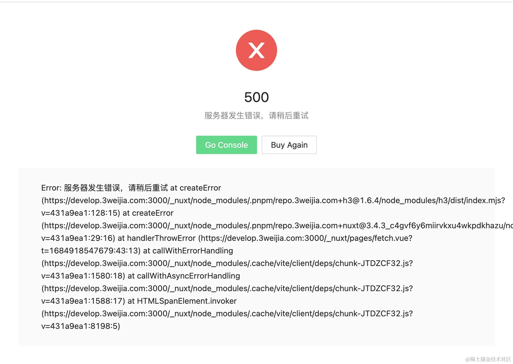

* * *

## 🍃环境变量

Nuxt CLI在开发模式下以及运行 nuxi build 和 nuxi generate 时内置了 dotenv 支持。

除了任何进程环境变量外，如果您的项目根目录中有一个.env文件，它将在构建、开发和生成时自动加载，并且在 nuxt.config 文件和模块中设置的任何环境变量都将可访问。

如果您想使用不同的文件 - 例如，使用 .env.local 或 .env.prod - 我们可以在使用 nuxi 时传递--dotenv 标志来实现。例如：

```css
npx nuxi dev --dotenv .env.local
```

在开发模式下更新 .env 文件时，Nuxt 实例会自动重新启动以将新值应用于 process.env。

runtimeConfig API 向应用程序的其余部分公开了诸如环境变量之类的值。默认情况下，这些键只在服务器端可用。runtimeConfig.public 中的键也可以在客户端使用。这些值应该在 nuxt.config 中定义，并且可以使用环境变量重写。我们还可以在 app.config 定义公开变量。二者区别是：

+   runtimeConfig：需要在使用环境变量构建后指定的私有或公共令牌。
+   app.config：在构建时确定的公共令牌，网站配置，如主题变量，标题和任何不敏感的项目配置。

.env 文件配置：

```text
# api Url
NUXT_PUBLIC_API_BASE_URL = 'https://magiccube-gateway.3weijia.com'

# oss Login Url
NUXT_PUBLIC_LOGIN_URL = 'https://passport-dev.3weijia.com'

# Basic Url
NUXT_PUBLIC_LOCATION_ORIGIN_URL = 'https://mall-dev.3weijia.com'
```

nuxt.config.ts 配置：

```ts
import { NuxtConfig } from "nuxt/config";

export default defineNuxtConfig({
  runtimeConfig: {
     public: {
        apiBaseUrl: process.env.NUXT_PUBLIC_API_BASE_URL,
        loginUrl: process.env.NUXT_PUBLIC_LOGIN_URL,
        locationOriginUrl: process.env.NUXT_PUBLIC_LOCATION_ORIGIN_URL,
     },
   }
} as NuxtConfig);
```

使用

```ts
const runtimeConfig = useRuntimeConfig();
const { loginUrl, locationOriginUrl } = runtimeConfig.public;
```

## 🍃数据请求

Nuxt提供了 useFetch, useLazyFetch, useAsyncData 和 useLazyAsyncData 来处理应用程序中的数据获取。

### useAsyncData

在页面、组件和插件中，我们可以使用useAsyncData来访问异步解析的数据。

```ts
function useAsyncData(
  key: string, // 一个唯一的键，以确保数据获取可以正确地跨请求去重复数据
  handler: (nuxtApp?: NuxtApp) => Promise<DataT>, // 返回值的异步函数，通常是一个$fetch函数
  options?: AsyncDataOptions<DataT>
): Promise<AsyncData<DataT>>

type AsyncDataOptions = {
  server?: boolean; // 是否从服务器上获取数据(默认为true)
  lazy?: boolean; // 是否在加载路由后解析async函数，而不是阻塞客户端导航(默认为false)
  default?: () => DataT | Ref<DataT> | null; // 一个工厂函数，在async函数解析之前设置数据的默认值
  transform?: (input: DataT) => DataT; // 解析后可用于改变handler函数结果的函数
  pick?: string[]; // 只从handler函数结果中选择该数组中的指定键
  watch?: WatchSource[]; // 监视响应源以自动刷新
  immediate?: boolean; // 当设置为false时，将阻止请求立即触发。
};

type AsyncData<DataT> = {
  data: Ref<DataT>; // 传入的异步函数的结果
  pending: Ref<boolean>; // 一个布尔值，指示是否仍在提取数据
  refresh: (opts?: { dedupe?: boolean }) => Promise<void>;
  execute: () => Promise<void>; // 可用于刷新handler函数返回的数据的函数
  error: Ref<Error | boolean>; // 如果数据获取失败，则错误对象。
};
```

$fetch 函数使用方式参考 [《MDN文档—使用Fetch》](https://developer.mozilla.org/zh-CN/docs/Web/API/Fetch_API/Using_Fetch "https://developer.mozilla.org/zh-CN/docs/Web/API/Fetch_API/Using_Fetch")

```html
<template>
  <NuxtLayout>
    <div class="fetch">
      <a-select
        v-model:value="value"
        :options="options"
        style="width: 200px"
        label-in-value
        @change="handleChange"
      ></a-select>
    </div>
  </NuxtLayout>
</template>

<script setup lang="ts">
const { data: options } = await useAsyncData(
  "mountains",
  () => $fetch("https://yapi.3weijia.com/mock/1357/api/geography"),
  {
    pick: ["data"],
  }
);

const value = ref<Value>();
const handleChange = (value: Value) => {
  console.log(value);
};
</script>
```

### useLazyAsyncData

默认情况下，useAsyncData 阻塞导航，直到它的 async 处理程序被解析。useLazyAsyncData 为 useAsyncData 提供了一个包装器，通过将 lazy 选项设置为 true，在处理程序解析之前触发导航。

### useFetch

这个对象为 useAsyncData 和 $fetch提供了一个方便的包装。

它根据URL和获取选项自动生成一个键，根据服务器路由为请求URL提供类型提示，并推断API响应类型。

```ts
function useFetch(
  url: string | Request | Ref<string | Request> | () => string | Request, // 要获取的URL
  options?: UseFetchOptions<DataT>
): Promise<AsyncData<DataT>>
```

```ts
 type UseFetchOptions = {
  key?: string; //  一个唯一的键，以确保数据获取可以正确地跨请求去重复数据，如果没有提供，它将基于使用useAsyncData的静态代码位置生成。
  method?: string; // 请求方法
  query?: SearchParams; // 查询搜索参数到URL
  params?: SearchParams; // query 的别名
  body?: RequestInit["body"] | Record<string, any>; // 请求体
  headers?: Record<string, string> | { key: string, value: string }[] | Headers; // 请求头
  baseURL?: string; // 请求的基本URL
  server?: boolean; // 是否从服务器上获取数据(默认为true)
  lazy?: boolean; // 
  immediate?: boolean; // 当设置为false时，将阻止请求立即触发。(默认为true)
  default?: () => DataT; // 一个工厂函数，在async函数解析之前设置数据的默认值
  transform?: (input: DataT) => DataT; // 解析后可用于改变handler函数结果的函数
  pick?: string[]; // 只从handler函数结果中选择该数组中的指定键
  watch?: WatchSource[]; // 监视响应源以自动刷新
};

type AsyncData<DataT> = {
  data: Ref<DataT>; // 传入的异步函数的结果
  pending: Ref<boolean>, // 一个布尔值，指示是否仍在提取数据
  refresh: (opts?: { dedupe?: boolean }) => Promise<void>;
  execute: () => Promise<void>; // 可用于刷新handler函数返回的数据的函数
  error: Ref<Error | boolean>; // 如果数据获取失败，则错误对象。
};
```

### useLazyFetch

这个可组合的行为与带有 lazy: true 选项集的 useFetch 相同。

由上可得以下关系：

|                    | useLazyFetch               | useAsyncData                                | useLazyAsyncData                                             |
| ------------------ | -------------------------- | ------------------------------------------- | ------------------------------------------------------------ |
| 与 useFetch 的关系 | lazy 设为 true 的 useFetch | useFetch 是 useAsyncData 与 $fetch 的语法糖 | useFetch 是 useAsyncData 与 $fetch 的语法糖，useLazyAsyncData 是 lazy 设为 true 的 useAsyncData |

换句话说，`useFetch` 可以实现其他三个API的所有功能。

### Request 的封装与使用

因个人开发习惯，所以不想使用 nuxt3 自带的接口返回格式才进行这样的简易封装；可以选择性忽视我这该死的笨拙，也可以私信我更好的封装方案。

+   ~enums/interface.ts  // 定义接口返回 code 值的枚举

```ts
export enum ResultEnum {
  SUCCESS = 0,
  TOKEN_OVERDUE = 210311001, // 用户登录失败
  INTERNAL_SERVER_ERROR = 210311099, // 服务异常
}
```

+   ~/composables/useDefaultRequest.ts  // 定义接口统一拦截函数

```ts
import { UseFetchOptions } from "nuxt/app";
import { RouteLocationRaw } from "vue-router";
import { ResultEnum } from "~/enums/interface";

interface DefaultResult<T = any> {
  code: number;
  data: T;
  msg: string;
  success: boolean;
}

type UrlType = string | Request | Ref<string | Request> | (() => string | Request);

type HttpOption<T> = UseFetchOptions<DefaultResult<T>>;

interface RequestConfig<T = any> extends HttpOption<T> {
  // 忽略拦截，不走拦截，拥有 responseData，且 code !== 0 的情况下，直接返回 responseData，
  // 但是若无 responseData， 不设置 ignoreGlobalErrorMessage 也会报错
  ignoreCatch?: boolean;

  // 忽略全局错误提示，走拦截，但是任何情况下都不会提示错误信息
  ignoreGlobalErrorMessage?: boolean;
}

const request = async <T>(
  url: UrlType,
  params: any,
  options: RequestConfig<T>
): Promise<DefaultResult<T> | T> => {
  const headers = useRequestHeaders(["cookie"]);
  const method = ((options?.method || "GET") as string).toUpperCase();

  const runtimeConfig = useRuntimeConfig();
  const nuxtApp = useNuxtApp();
  const { $message, $login } = nuxtApp;
  const { apiBaseUrl } = runtimeConfig.public;
  const baseURL = `${apiBaseUrl}/mall/api`;

  // 处理用户信息过期
  const hanlerTokenOverdue = async () => {
    const { _route } = nuxtApp;
    await $login(_route?.fullPath);
  };

  // 处理报错异常
  const handlerError = (msg = "服务异常") => {
    if (process.server) {
      showError({ message: msg, statusCode: 500 });
    } else {
      $message.error(msg);
    }
  };

  const { data, error } = await useFetch(url, {
    baseURL,
    headers,
    credentials: "include",
    params: method === "GET" ? params : undefined,
    body: method === "POST" ? JSON.stringify(params) : undefined,
    ...options,
  });

  const responseData = data.value as DefaultResult<T>;
  const { ignoreCatch, ignoreGlobalErrorMessage } = options; // 忽略全局

  if (error.value || !responseData) {
    if (!ignoreGlobalErrorMessage) handlerError();
    return Promise.reject(error.value || "服务响应失败，请稍后重试");
  } else {
    const { code, data: result, msg } = responseData;
    // 接口请求成功，直接返回结果
    if (code === ResultEnum.SUCCESS || !code) {
      return result;
    }
    if (!ignoreCatch) {
      // 接口请求错误，统一处理
      switch (code) {
        case ResultEnum.TOKEN_OVERDUE: // 登录信息过期，去登录
          // 用户信息过期
          await hanlerTokenOverdue();
        default:
          if (!ignoreGlobalErrorMessage) handlerError(msg);
          return Promise.reject(msg || "服务响应失败，请稍后重试");
      }
    }
  }

  return responseData;
};

// 自动导出
export const useDefaultRequest = {
  get: <T>(url: UrlType, params?: any, option?: RequestConfig<T>) => {
    return request<T>(url, params, { method: "get", ...option });
  },
  post: <T>(url: UrlType, params?: any, option?: RequestConfig<T>) => {
    return request<T>(url, params, { method: "post", ...option });
  },
};
```

+   ~/api/modules/system/model/UserType.ts  // 定义系统用户模块接口相关TS类型

```ts
export type FecthUserInfoResp = {
  avatarUrl?: string; // 头像
  isDelete?: number; // 删除标志
  mobile?: string; // 手机号
  name?: string; // 用户姓名
  nickname?: string; // 用户昵称
  regDate?: string; // 注册时间
  regEmail?: string; // 注册邮箱
  status?: number; // 用户状态
  userId?: string; // 用户ID
};
```

+   ~/api/modules/system/user.ts  // 定义系统用户模块接口

```ts
import { FecthUserInfoResp, FetchGeographyResp } from "./model/UserType";
/**
 * @description: 不提示获取用户信息
 */
export function selectByUserIdBySlient(params?: any) {
  return useDefaultRequest.get<FecthUserInfoResp>("/user/selectByUserId", params, {
    ignoreCatch: true, // 不走统一拦截，一个法外之地的接口
    ignoreGlobalErrorMessage: true, // 报错不提示
  });
}

/**
 * @description: 获取用户信息
 */
export function selectByUserId(params?: any) {
  return useDefaultRequest.get<FecthUserInfoResp>("/user/selectByUserId", params);
}
```

+   ~/pages/index.vue  // 业务组件使用方式

```html
<script setup lang="ts">
import { selectByUserId } from "~/api/modules/system/user";
import { FecthUserInfoResp } from "~/api/modules/system/model/UserType";
  
const userInfo = ref<FecthUserInfoResp>({});
try {
   userInfo.value = await selectByUserId();
} catch (err) {
   console.log(err);
}
</script>
```

> **important**： 因为接口封装使用了 `return Promise.reject()`；这在服务端执行会显示错误页，但是不使用 `return Promise.reject()` 又会使得不能中断后续流程；所以，为了让显示错误页是可控的，通过我们的接口拦截去显示的，页面调用接口时，应该包裹在 `try catch` 中。

## 🍃模块

### 引入less

在项目中断执行安装 less

```sql
pnpm add less --save
```

在assets目录下创建less全局变量文件

```diff
-| assets/
---| styles/
------| index.less
```

```less
// ~/assets/styles/index.less 内容
@theme-color: #147ffa;
```

使用 vite 打包的话，需要在 nuxt.config.ts 上配置

```ts
import { NuxtConfig } from "nuxt/config";

export default defineNuxtConfig({
  vite: {
    css: {
      preprocessorOptions: {
        less: {
          additionalData: '@import "@/assets/styles/index.less";',
        },
      },
    },
  },
} as NuxtConfig);
```

使用方式

```html
<style lang="less" scoped>
.home {
  .blue {
    color: @theme-color;
  }
}
</style>
```

* * *

### 引入ant-design-vue

**（经 @玉淇冰KybinYu 提醒，现在nuxt已经有[ant-design-vue](https://www.nuxt.com.cn/modules/ant-design-vue "https://www.nuxt.com.cn/modules/ant-design-vue")的模块了，可以直接使用该模块，不再需要手动引入了）**

#### 按需引入

在项目终端执行安装 ant-design-vue

```sql
pnpm add ant-design-vue --save
```

项目中，我们使用的 Vite 打包，可以使用 [unplugin-vue-components](https://github.com/antfu/unplugin-vue-components "https://github.com/antfu/unplugin-vue-components") 来进行按需加载。但是此插件无法处理非组件模块，如 message，这种组件需要手动加载。

```sql
pnpm add unplugin-vue-components --save
```

在nuxt.config.ts中配置

```ts
import Components from "unplugin-vue-components/vite";
import { AntDesignVueResolver } from "unplugin-vue-components/resolvers";
import { NuxtConfig } from "nuxt/config";

export default defineNuxtConfig({
  vite: {
    plugins: [
      Components({
        resolvers: [
          AntDesignVueResolver(),
        ],
      }),
    ],
  },
} as NuxtConfig);
```

#### 配置主题

antdv 的样式使用了 Less 作为开发语言，并定义了一系列全局/组件的样式变量，我们可以根据需求进行相应调整。 antdv 使用 modifyVars 的方式来进行覆盖变量。在nuxt.config.ts中配置：

```diff
export default defineNuxtConfig({
  vite: {
    plugins: [
      Components({
        resolvers: [
--        AntDesignVueResolver(),
++        AntDesignVueResolver({
++          importStyle: "less",
++        }),
        ],
      }),
    ],
    css: {
      preprocessorOptions: {
        less: {
          additionalData: '@import "@/assets/styles/index.less";',
++        modifyVars: {
++          "primary-color": "#04dc82",
++        },
++        javascriptEnabled: true,
        },
      },
    },
  },
} as NuxtConfig);
```

### postcss-px-to-viewport-8-plugin

如果是H5项目，需要rem适配，可以推荐安装插件 `postcss-px-to-viewport-8-plugin` 用于px转rem。

```text
pnpm install postcss-px-to-viewport-8-plugin -D
```

在 nuxt.config.ts 文件中配置 vite 打包配置项：

```ts
import type { NuxtConfig } from '@nuxt/schema';
const pxtoviewport = require('postcss-px-to-viewport-8-plugin');

export default defineNuxtConfig({
  vite: {
    css: {
      postcss: {
        plugins: [
          pxtoviewport({
            viewportWidth: 750, // 视窗的宽度，对应的是我们设计稿的宽度，一般是750
            viewportHeight: 1334, // 视窗的高度，根据750设备的宽度来指定，一般指定1334，也可以不配置
            unitPrecision: 3, // 指定`px`转换为视窗单位值的小数位数（很多时候无法整除）
            viewportUnit: 'vw', // 指定需要转换成的视窗单位，建议使用vw
            selectorBlackList: ['.ignore', '.hairlines'], // 指定不转换为视窗单位的类，可以自定义，可以无限添加,建议定义一至两个通用的类名
            minPixelValue: 1, // 小于或等于`1px`不转换为视窗单位，你也可以设置为你想要的值
            mediaQuery: false, // 允许在媒体查询中转换`px`
            exclude: /node_modules/,
            include: /src/,
          }),
          // 针对 Vant UI 组件库
          pxtoviewport({
            viewportWidth: 375,
            // eslint-disable-next-line no-useless-escape
            include: /node_modules[\\\/]vant/,
            exclude: /src/,
          }),
        ],
      },
    },
  },
} as NuxtConfig);

```

上面配置中，因为我们项目的 UI 设计稿是 750 的，`viewportWidth` 需要设置成 750，但是使用的 Vant UI 组件库，为了 `Vant` 的组件也可以匹配，则专门对其进行了配置。

## 🍃遇到的问题与解决方案

### useFetch() 在 onMounted 执行返回值为 null？

+   场景一

```html
<template>
  <div class="test">
    {{ testData }}
    <van-button type="default" @click="testFetch1">取消订单</van-button>
  </div>
</template>
<script lang="ts" setup>
  const testData = ref();
  const id = ref('wx9d982ed41aa8b75a');
  const testFetch1 = async () => {
    useFetch(`https://paas-fe-dev.3weijia.com/helper/server/wechat/mp/app/${id.value}`, {
      key: 'myfetch',
    }).then((res) => {
      testData.value = res.data.value;
      console.log('testData.value', process.server, testData.value);
    });
  };

  onMounted(() => {
    console.log('onMounted');
    testFetch1(); 
  });
</script>
```

我们可以通过 console.log 发现，刷新页面后，客户端执行了 testFetch1 中的 useFetch，但是返回结果为 null；而服务端没有打印日志，得出结论服务端不执行 onMounted 内容。

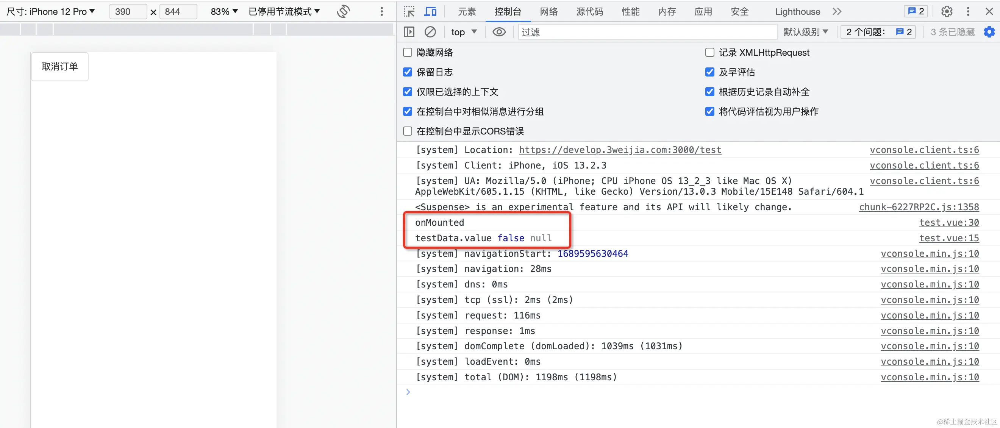

当我们从其他页面通过 router.push/replace 进入这个页面时，即客户端渲染时，发现接口拥有返回数据，渲染正常。

当我们在 onMounted 中添加 await nextTick()；发现接口拥有返回数据，渲染正常。

```diff
      onMounted(async () => {
        console.log('onMounted');
++      await nextTick();
        testFetch1();
      });
```

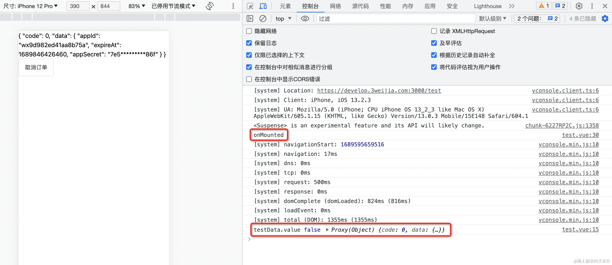

+   场景二

```html
<template>
  <div class="test">
    {{ testData }}
    <van-button type="default" @click="testFetch1">取消订单</van-button>
  </div>
</template>
<script lang="ts" setup>
  const testData = ref();
  const id = ref('wx9d982ed41aa8b75a');
  const testFetch1 = async () => {
    useFetch(`https://paas-fe-dev.3weijia.com/helper/server/wechat/mp/app/${id.value}`, {
      key: 'myfetch',
    }).then((res) => {
      testData.value = res.data.value;
      console.log('testData.value', process.server, testData.value);
    });
  };

  testFetch1();
</script>
```

直接在 setup 执行 useFetch，虽然页面渲染正常，接口请求正常，但是控制台有报错信息：Hydration completed but contains mismatches. ，表明服务端和客户端渲染 testData 内容不一致，如图：


终端拥有打印信息：

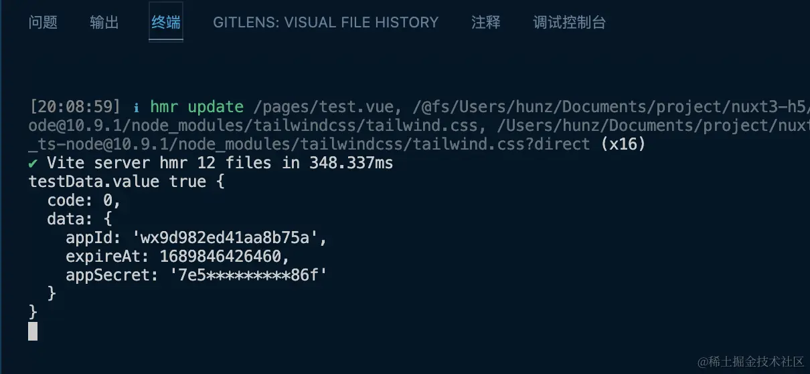

说明服务端、客户端都执行了 useFetch，且返回结果一致，需要解决这个报错内容有两种解决方式：

1.  使用标签将 {{ testData }} 包裹起来

```diff
  <template>
    <div class="test">
++    <div>
        {{ testData }}
++    </div>
      <van-button type="default" @click="testFetch1">取消订单</van-button>
    </div>
  </template>
```

但是这可能不太符合我们的预期，因为我们并不会对每个这种渲染对象都使用唯一标签包裹，那太麻烦了。

2.  将 testFetch1 改造一下，等待 testFetch2 执行完毕后再进行渲染

```html
<script lang="ts" setup>
  const testData = ref();
  const id = ref('wx9d982ed41aa8b75a');
  const testFetch2 = async () => {
    const { data } = await useFetch(`https://paas-fe-dev.3weijia.com/helper/server/wechat/mp/app/${id.value}`);
    testData.value = data.value;
  };
  await testFetch2();
</script>
```

> 服务端不执行onMounted内容；  
> 如果onMounted内需执行useFetch，应该放在await nextTick之后，否则会返回null；  
> 在setup内(onMounted外)执行useFetch，服务端和客户端都执行，为了避免渲染时useFetch未执行完毕，尽量使用await而不是then方法；

后面在官方文档翻到这句话，可能就是客户端在没有激活之前，放在onMounted的useFetch返回null的原因吧 

### composables定义了某变量并赋值，浏览器刷新后服务端获取该变量还是旧值？

+   场景  
    我们在composables文件夹下新建文件useTest.ts，里面包含一个变量tcc与useTest组合方法，useTest获取某cookie值保存到tcc变量中，原本设想是，改变量若是有值，就不再重新获取的。

```ts
let tcc: string | null | undefined;

export const useTest = () => {
  if (!tcc) {
    const tccRef = useCookie('tcc');
    tcc = tccRef.value;
  }
  return tcc;
};
```

在vue文件的setup执行该方法：

```html
<script lang="ts" setup>
  console.log('useTest()', useTest());
</script>
```

浏览器cookie添加tcc参数值为「PC\_MALL」，刷新浏览器后，发现客户端与服务端都打印了useTest()值为「PC\_MALL」

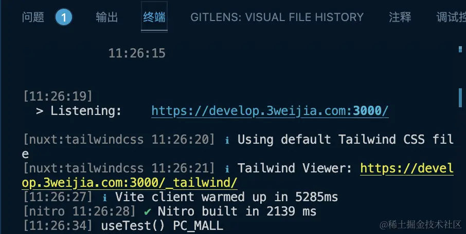

然后我们修改浏览器cookie中tcc参数值为「H5\_MALL」，刷新浏览器发现客户端打印了新的cookie值，但是服务端还是旧值

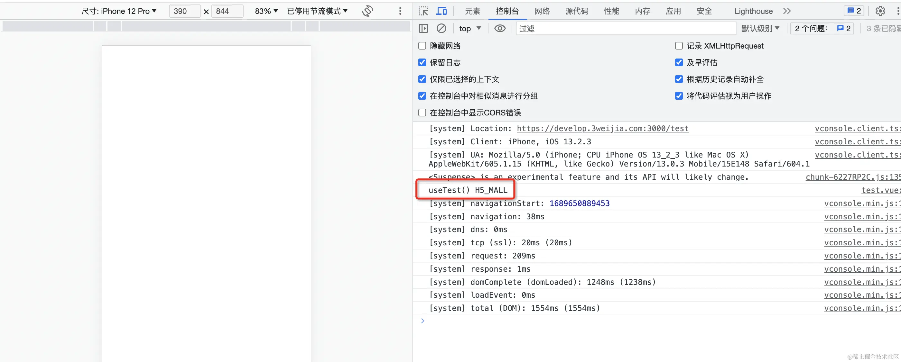

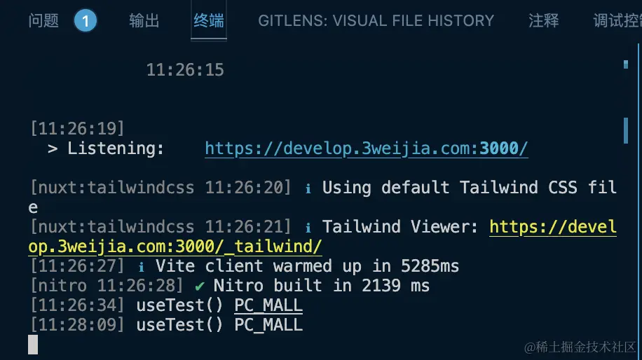

这感觉看上去像是composables下定义的组合文件内容在服务端只执行一次，不知道nuxt这样设计的原因，只能要求开发的时候注意啦~

> 在组合中尽量不定义变量保存客户端信息（如cookie、storage等）

### 某些DOM节点渲染了两遍

+   场景

打包之后，在APP内预览发现页面异常，有些DOM节点渲染了两遍。其中第一次渲染的DOM不能点击，第二次渲染的DOM可以点击。

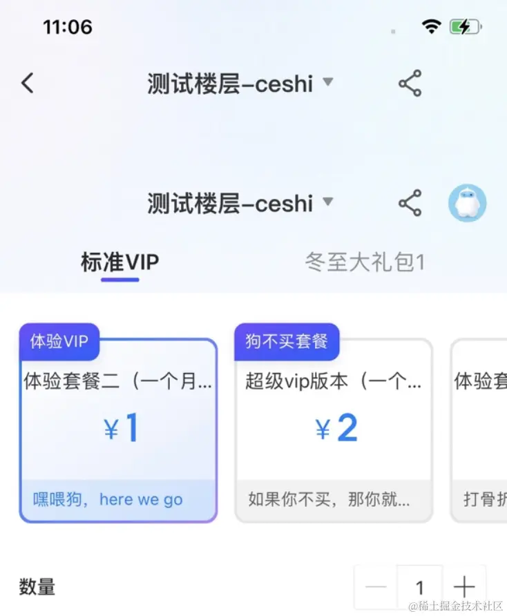

经过多番测试，发现是我在setup初始化写了路由的重定向。

```html
<script setup lang="ts">
await router.replace({
  name: 'index',
  query: {
    floor: activeFloorId.value,
    spu: activeSpuId.value,
    sku: activeSkuId.value,
  },
});
</script>
```

如果我把 router.replace 放在 onMounted 里面执行依旧会出现此问题

```html
<script setup lang="ts">
onMounted(async () => {
  await router.replace({
    name: 'index',
    query: {
      floor: activeFloorId.value,
      spu: activeSpuId.value,
      sku: activeSkuId.value,
    },
  });
})
</script>
```

但是在onMounted添加nextTick之后，显示正常

```diff
<script setup lang="ts">
    onMounted(async () => {
++    await nextTick();
      await router.replace({
        name: 'index',
        query: {
          floor: activeFloorId.value,
          spu: activeSpuId.value,
          sku: activeSkuId.value,
        },
      });
    })
</script>
```

查阅资料后初步判定是ssr引起的。为了部分DOM能ssr渲染，又能在客户端保留vdom的优势，vue的做法是在ssr生成的html的基础上，再同时生成一个js文件。  
js文件里同时保存在客户端能再现渲染的js版本，js版本里是通过vdom进行渲染的操作函数，而html是ssr后的结果。  
当浏览器拿到这两个东西之后，就开始重新执行一遍vdom的生成过程，并在此基础上去执行客户端动态操作。那一旦出现不匹配的情况，那dom渲染就会出问题，部分界面组件会重复渲染。  
所以初始化的时候我们可以认为第一次渲染的DOM节点是服务端的首屏的静态HTML，点击无效。第二次渲染的DOM节点是属于客户端渲染的结果。

### 如何设置页面客户端渲染

这个问题是在评论中发现的，就一起记录了。

+   场景一：关闭项目所有页面的ssr 对于不需要索引或用户经常访问的高度交互式web应用程序，可以在nuxt.config.ts中使用Nuxt启用仅客户端渲染：

```ts
    export default defineNuxtConfig({ ssr: false })
```

+   场景二：仅对个别页面关闭ssr  
    使用路由规则：从Nuxt 3开始随着公测rc. 12 版本发布，支持路由规则和混合渲染。使用路由规则，您可以为一组nuxt路由定义规则，改变呈现模式或分配基于路由的缓存策略。

    +   `redirect` - 重定向。
    +   `ssr` - 禁用应用程序部分的服务器端渲染，并使用`ssr: false`使它们仅用于spa。
    +   `cors` - 自动添加带有`cors: true`的cors报头-你可以通过用`headers`覆盖自定义输出
    +   `headers` - 为站点的各个部分添加特定的标题
    +   `static` and `swr` - `static`支持单个(按需)构建;`swr`启用静态构建，该构建持续一个可配置的TTL。  
        **配置ssr示例:**

    ```ts
    export default defineNuxtConfig({
      routeRules: {
        '/admin/**': { ssr: false },
      },
    });
    ```


> 如果确实使用`ssr:false`，还应该在/src目录新增app文件夹，文件夹下建立spa-loading-template.html文件（如果没有使用本文中的/src目录的配置，要在根目录下新增app文件夹），html文件中包含一些我们想用来渲染加载页面的HTML。

* * *

[demo地址](https://gitee.com/roey2020/starter-3.git "https://gitee.com/roey2020/starter-3.git") ：项目内接口相关地址以及单点登录地址需替换，目前是访问不了的乱写的地址。

* * *

文章更新中，感谢大家的阅读，如果文章内容有不对的地方，希望大家帮忙指出。
